# Fennec Animation


<!-- [](https://fennec.michellef.dev) -->

A config‑driven, canvas‑based pixel animation synced to a song. Fork it, drop in your own artwork, and watch your animation come to life.

[](https://fennec.michellef.dev)

[](https://fennec.michellef.dev)

## Table of Contents

- [Summary](#summary)
- [Getting Started](#getting-started)
  - [Requirements](#requirements)
  - [Initial Setup](#initial-setup)
  - [Add a Song](#add-a-song)
  - [Update the Artwork](#update-the-artwork)
  - [Preview and Deploy](#preview-and-deploy)
- [Project Architecture](#project-architecture)
- [Extending the Project](#extending-the-project)
- [Commands](#commands)
- [Deploying Updates to Production](#deploying-updates-to-production)
- [Resources](#resources)
- [Notes](#notes)
  - [Dev vs Preview](#dev-vs-preview)
- [License](#license)

## Summary

- **What:** Next.js + Canvas pixel animation synced to a song
- **Highlights:** Config-first timelines (no engine), clean canvas pipeline, audio-driven progress, static export
- **Try it:**
  - **Windows:** `git clone https://github.com/michellevit/Fennec-Animation.git && cd Fennec-Animation && npm i && npm run preview`
  - **macOS/Linux:** `git clone https://github.com/michellevit/Fennec-Animation.git && cd Fennec-Animation && npm i && npm run preview-mac`
- **Customize:** Replace image/song assets in `./public/*` or tweak `./components/Animation/config/*.ts`
- **Env:** Node 18+ • modern Chrome/Edge/Firefox/Safari • macOS/Windows/Linux

## Getting Started

Use this repository as a foundation to animate your own story with your own artwork. Minimal TypeScript edits—mostly just swapping assets and updating config.

### Requirements

- **Node.js 18+** and **npm**
- **Git**

_Optional (for convenience):_

- **GitHub CLI (`gh`)** if you want to run the “Use as a template” or “fork & clone” one-liners (`gh auth login` required)
- **Windows only:** PowerShell (built-in) is used by the `clean.ps1` step that runs in `npm run preview` / `npm run deploy`
- **macOS/Linux:** No PowerShell needed—use `npm run preview-mac` / `npm run deploy-mac`

_Alternative (no `gh`):_ use the GitHub UI (“Use this template”) or run  
`git clone https://github.com/michellevit/Fennec-Animation.git && cd Fennec-Animation && npm i && (npm run preview || npm run preview-mac)`

### Initial Setup

_Requirements: Node 18+ and npm._

Use as a **Template**:

```bash
gh repo create YOURUSER/Fennec-Remix \
  --template michellevit/Fennec-Animation \
  --public --clone
cd Fennec-Remix && npm i && npm run preview      # Windows
# or
cd Fennec-Remix && npm i && npm run preview-mac  # macOS/Linux

```

or **fork + clone** this repository:

```bash
# Windows
gh repo fork michellevit/Fennec-Animation --clone && cd Fennec-Animation && npm i && npm run preview

# macOS/Linux
gh repo fork michellevit/Fennec-Animation --clone && cd Fennec-Animation && npm i && npm run preview-mac
```

_Optional: [deploy to GitHub Pages](./docs/deploying-to-the-web.md)_

### Add a Song

- Add your track to the folder **`./public/music`** with the name **`song.mp3`**
- If you use a different path/name, update the audio source in **`./components/Controller/Controller.tsx`**
- Song length
  - The app auto-detects the track length from `./public/music/song.mp3`. If metadata isn’t available, it falls back to **90 s**
  - To override, set `FALLBACK_DURATION` in `./components/Controller/Controller.tsx`
- Keep files ≤ **10–20 MB** for faster loads. MP3 (CBR or VBR) at 128–256 kbps is plenty

### Update the Artwork

#### Where Assets Live

```txt
public/
  elements/      # sun, moon, stars, small props
  ground/        # scene strips + transitions between scenes
    transitions/ # images used to blend scene_X -> scene_Y
  parallax/      # background layers (e.g., distant clouds)
  sprite/        # fox frames (start/run/jump/etc.)
  favicon        # site icon for production/GitHub Pages
  music/         # song.mp3 (replace with your track)
```

#### General Guidelines:

- Use PNG with transparency for sprites/elements; PNG/JPG for wide ground layers
- Keep sprite frames the same width/height across an action (and ideally across all actions) for smooth animation
- Export pixel art with nearest-neighbor (no smoothing) so edges stay crisp
- Ground seams: design edges to butt cleanly so the horizontal slide shows no gaps, and ensure the height is identical to avoid uneven ground between frames
- Keep file sizes reasonable (web): prefer a few wide layers over many tiny slices
- _Optional: use [Pixil Art](https://www.pixilart.com/)_

#### What to Change (minimal code)

- Replace files in public/\* with your art (keep names if you want to avoid code changes)
- If you rename or add files, update the matching config:
  - `./components/Animation/config/spriteConfig.ts` — map actions → frame filenames
  - `./components/Animation/config/groundConfig.ts` — order scenes/transitions and their durations
  - `./components/Animation/config/fadeConfig.ts` — crossfades and day/night timing

#### Examples

Sprite mapping (`./components/Animation/config/spriteConfig.ts`)

```ts
export const spriteConfig = {
  start: ["start1.png", "start2.png"],
  run: ["run1.png", "run2.png"],
  jump: ["jump1.png"],
};
```

Ground timeline (`./components/Animation/config/groundConfig.ts`)

```ts
export const groundTimeline = [
  { type: "scene", path: "scene_1/", duration: 8 },
  { type: "transition", path: "transitions/desert-forest.png", duration: 2 },
  { type: "scene", path: "scene_2/", duration: 8 },
  { type: "scene", path: "scene_3/", duration: 8 },
  { type: "scene", path: "scene_4/", duration: 8 },
  { type: "end", action: "hole" },
];
```

#### Quick Checklist

- ☐ New song placed at public/music/song.mp3 (or update the reference)
- ☐ Sprite frames added to public/sprite/ with consistent dimensions
- ☐ Scenes and any transition images in public/ground/ and public/ground/transitions/
- ☐ Updated spriteConfig.ts + groundConfig.ts to match filenames/timings
- ☐ npm run preview to verify seams, timing, and overall feel

### Preview and Deploy

```bash
# Preview locally
npm run preview     # Windows
npm run preview-mac # macOS/Linux

# Deploy to GitHub Pages
npm run deploy      # Windows
npm run deploy-mac  # macOS/Linux
```

## Project Architecture

- **Controller** (`./components/Controller/Controller.tsx`): loads the audio element, tracks `currentTime`/`duration`, forwards them to the canvas
- **Canvas** (`./components/Canvas/Canvas.tsx`): owns the `<canvas>`, size, and 2D context; mounts the animation loop
- **Animation** (`./components/Animation/Animation.tsx`): preloads assets and orchestrates per-frame draw calls
- **Config** (`./components/Animation/config/*`): data-driven timelines & settings
  - `spriteConfig.ts` — sprite actions → frame files
  - `groundConfig.ts` — scene order + transition frames
  - `fadeConfig.ts` — crossfades, day/night gates
- **Helpers** (`./components/Animation/helpers/*`): rendering and timing utilities
  - `drawSky`, `drawParallax`, `drawGround`, `drawSprite`, `drawStars`, `drawFade`, `drawGlobalLight`, etc.
  - `buildGroundTimeline.ts` — converts config → timed ground segments (scaled to the song duration)
- **Assets** (`./public/*`): images and audio (e.g., `sprite/`, `ground/`, `elements/`, `parallax/`, `music/song.mp3`)

<p align="left">
  
</p>

## Extending the Project

### Add a New Scene

1. Drop art into `./public/ground/scene_5/`
2. Reference it in `./components/Animation/config/groundConfig.ts`
3. Run `npm run preview` and verify seams

### Add a Sprite Action

1. Add frames to `./public/sprite/` (same width/height)
2. Map them in `./components/Animation/config/spriteConfig.ts` (e.g., `dash: ["dash1.png", "dash2.png"]`)
3. Hook the action where needed in the animation timeline

## Commands

```bash
npm run dev         # hot-reload dev server (localhost:3000)
npm run preview     # Windows: build (with PowerShell) + serve static export
npm run preview-mac # macOS/Linux: build (no PowerShell) + serve static export
npm run deploy      # Windows: build (with PowerShell) + push to gh-pages
npm run deploy-mac  # macOS/Linux: build (no PowerShell) + push to gh-pages
```

npm run preview prints both a localhost URL (for this machine) and a LAN URL (for phones/tablets on the same Wi‑Fi)

> **Note:** Use `npm run dev` if you prefer hot‑reload during code edits, or else use preview instead to simulate production (but don't run both at the same time) - [more info here](#dev-vs-preview)

## Deploying Updates to Production

_Prerequisite: [deploy to GitHub Pages](./docs/deploying-to-the-web.md)_

> **Note:** If you fork and deploy to GitHub Pages - remove or replace `./public/CNAME`
> It points to my custom domain and will cause your Pages deploy to fail unless you own that domain

After making changes to your project:

```bash
git add .
git commit -m "Your commit message here"
git push origin main

npm run deploy-mac # mac
npm run deploy # windows

```

This will:

- Rebuild your project using next build
- Export the contents of the /out folder to the gh-pages branch
- This keeps your source code in main, and your deployed static site in gh-pages

> **Platform note:** On macOS/Linux use `preview-mac` / `deploy-mac`.  
> Windows uses `preview` / `deploy` (includes a PowerShell clean step).

## Resources

- [Pixil Art](https://www.pixilart.com/)

## Notes

### Dev vs Preview

#### npm run dev

- Hot reloads on file changes
- Includes dev-only code (warnings, slow paths)
- Fast rebuilds for dev feedback
- Not optimized for speed or size

#### npm run preview

- Uses output of next build (optimized, minified, production-ready files)
- No hot reloads
- Exactly what will be deployed to production
- Useful for realistic testing

### npm run preview: Local vs Network:

When running the local preview server, you'll see two addresses:

- http://localhost:5000
- http://10.0.0.89:5000

#### Use http://localhost:5000 when:

- Testing in your local browser (Chrome, Firefox, Edge)
- Previewing layout, animations, and functionality on your own computer
- You don’t need to test from other devices

#### Use http://10.0.0.89:5000 when:

- Testing the site on a phone, tablet, or another device connected to your Wi-Fi/LAN
- Checking responsive layouts and touch interactions on different screen sizes
- Demoing the project to someone else on the same network

#### Summary

- Both links serve the exact same local build
- The only difference is which device you're accessing it from
- localhost only works on the computer you run `npm run preview` on

## License

This project is licensed under the **MIT License**.
